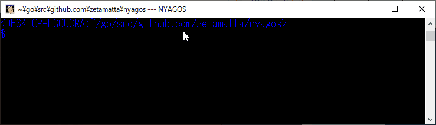

[](https://ci.appveyor.com/project/zetamatta/nyagos)
[](https://godoc.org/github.com/nyaosorg/nyagos)
[](https://goreportcard.com/report/github.com/nyaosorg/nyagos)
[](https://github.com/nyaosorg/nyagos/releases/latest)

The Nihongo Yet Another GOing Shell
===================================

[English](./readme.md) / Japanese

NYAGOS は Go と Lua で記述されたコマンドラインシェルです。



Windows には UNIXと互換性のあるシェルがありますが、ほとんどのシェルは
多くのアプリケーションが引数にとる `X:\DIR\FILE.EXT` のような Windows の
パス形式をサポートしていません。

ゆえに、次のような機能を持つ新シェルを作成しました。

* UNIX風シェル
  * キーバインド
    * デフォルト：Bash風
    * カスタマイズ
        * `nyagos.key.c_u = "KILL_WHOLE_LINE"` on %USERPROFILE%\\.nyagos ([Lua](https://github.com/yuin/gopher-lua))
    * Lua関数のキーへのバインド
        * `nyagos.key.escape = function(this) nyagos.exec("start vim.exe") end`
  * ヒストリ (Ctrl-P や ! マークによる)
  * エイリアス
    * DOSKEY風
        * `nyagos.alias["g++"]="g++.exe -std=gnu++17 $*"`
    * Lua関数による実装
        * `nyagos.alias["lala"]=function(args) nyagos.exec("ls","-al",unpack(args)) end`

  * カスタム補完
```lua
            nyagos.complete_for["go"] = function(args)
                if #args == 2 then
                    return {
                        "bug","doc","fmt","install","run","version",
                        "build","env","generate","list","test","vet",
                        "clean","fix","get","mod","tool" }
                else
                    return nil -- files completion
                end
            end
```
* CMD.EXE同様のウインドウズの作法に従うシェル
  * `C:\path\to\file` のような Windowsパス使用可能
  * ドライブごとにカレントディレクトリを保持
  * `copy`,`move` など DOS 風の内蔵コマンドが動作
  * ランタイムDLL不要
  * レジストリ無使用
* カラーコマンドライン
* Unicodeサポート
  * Unicode文字をコピペ・編集可能
  * Unicodeリテラル %U+XXXX%
  * プロンプト向けマクロ $Uxxxx
* 内蔵ls
  * カラーサポート(-oオプション)
  * ハードリンク・シンボリックリンク・ジャンクションのリンク先を表示
* サポート OS
  * Windows 8.1以降
  * Linux (試験的サポート)

ダウンロード
------------

* https://github.com/nyaosorg/nyagos/releases

目次
----

### リリースノート

- [4.4.x](docs/release_note_ja.md)
- [4.3.x](docs/history-4.3_ja.md)
- [4.2.x](docs/history-4.2_ja.md)
- [4.1.x](docs/history-4.1_ja.md)
- [4.0.x](docs/history-4.0_ja.md)

### ドキュメント

1. [インストール](docs/01-Install_ja.md)
2. [起動オプション](docs/02-Options_ja.md)
3. [編集機能](docs/03-Readline_ja.md)
4. [内蔵コマンド](docs/04-Commands_ja.md)
5. [起動処理](docs/05-Startup_ja.md)
6. [コマンドライン置換](docs/06-Substitution_ja.md)
7. [Lua拡張](docs/07-LuaFunctions_ja.md)
8. [アンインストール](docs/08-Uninstall_ja.md)
9. [ビルド方法](docs/09-Build_ja.md)

ライセンス
----------

修正BSDライセンスに基いて、使用・コピー・改変が可能です。

謝辞
----

* [nocd5](https://github.com/nocd5)
* [mattn](https://github.com/mattn)
* [hattya](https://github.com/hattya)
* [shiena](https://github.com/shiena)
* [atotto](https://github.com/atotto)
* [ironsand](https://github.com/ironsand)
* [kardianos](https://github.com/kardianos)
* [malys](https://github.com/malys)
* [pine613](https://github.com/pine613)
* [NSP-0123456](https://github.com/NSP-0123456)
* [hokorobi](https://github.com/hokorobi)
* [amuramatsu](https://github.com/amuramatsu)
* [spiegel-im-spiegel](https://github.com/spiegel-im-spiegel)
* [rururutan](https://github.com/rururutan/)
* [hogewest](https://github.com/hogewest)
* [cagechi](https://github.com/cagechi)
* [Matsuyanagi](https://github.com/Matsuyanagi)
* [Shougo](https://github.com/Shougo)
* [orthographic-pedant](https://github.com/orthographic-pedant)
* HABATA Katsuyuki
* [hisomura](https://github.com/hisomura)
* [tsuyoshicho](https://github.com/tsuyoshicho)
* [rane-hs](https://github.com/rane-hs)
* [hami-jp](https://github.com/hami-jp)
* [3bch](https://github.com/3bch)
* [AoiMoe](https://github.com/aoimoe)
* [DeaR](https://github.com/DeaR)
* [gracix](https://github.com/gracix)
* [orz--](https://github.com/orz--)
* [zkangaroo](https://github.com/zkangaroo)
* [maskedw](https://github.com/maskedw)
* [tyochiai](https://github.com/tyochiai)
* [masamitsu-murase](https://github.com/masamitsu-murase)
* [hazychill](https://github.com/hazychill)
* [erw7](https://github.com/erw7)
* [tignear](https://github.com/tignear)
* [crile](https://github.com/crile)
* [fushihara](https://github.com/fushihara)
* [ChiyosukeF](https://twitter.com/ChiyosukeF)
* [beepcap](https://twitter.com/beepcap)
* [tostos5963](https://github.com/tostos5963)
* [sambatriste](https://github.com/sambatriste)
* [terepanda](https://github.com/terepanda)
* [Takmg](https://github.com/Takmg)
* [nu8](https://github.com/nu8)
* [tomato3713](https://github.com/tomato3713)
* [tGqmJHoJKqgK](https://github.com/tGqmJHoJKqgK)
* [juggler999](https://github.com/juggler999)

開発者
------

* [zetamatta](https://github.com/zetamatta)
<!-- vim:set fenc=utf8 -->
